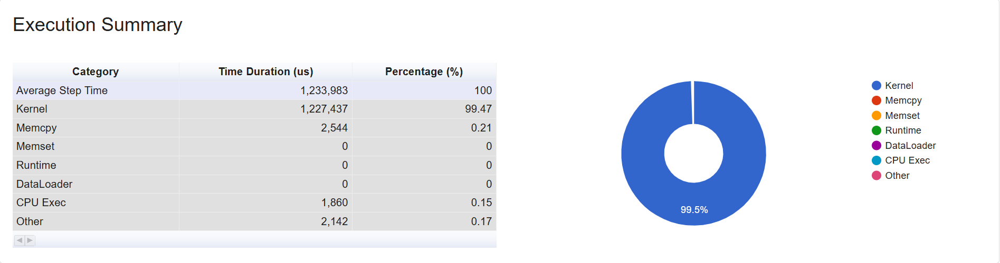
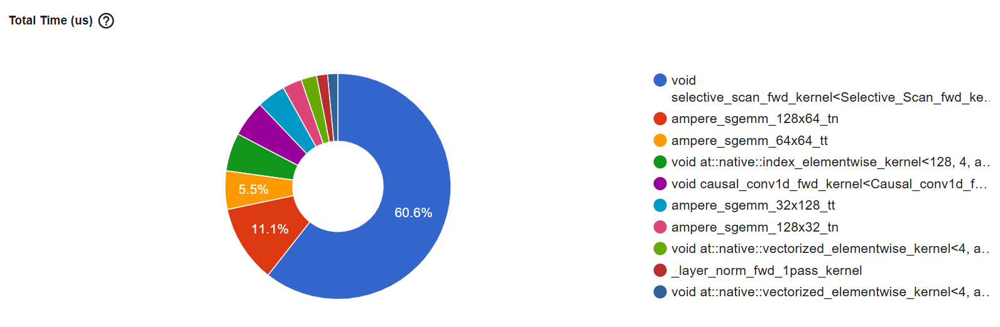

# PyTorch Profiler Analysis — Vim Eval on Jetson Orin Nano

Profiling was done using PyTorch's built-in profiler on `vim_tiny` eval (ImageNet val set, batch_size=4).
The profiler was configured to skip 1 warmup batch and actively profile 3 batches.

---

## How to Reproduce

Add the following to `engine.py` and call `evaluate(..., enable_profiling=True)` from `main.py`:

```python
# engine.py — top of file
from torch.profiler import profile, record_function, ProfilerActivity

# engine.py — evaluate() signature
def evaluate(data_loader, model, device, amp_autocast, enable_profiling=False):

    # inside evaluate(), before the loop
    if enable_profiling:
        profiler = profile(
            activities=[ProfilerActivity.CPU, ProfilerActivity.CUDA],
            record_shapes=True,
            profile_memory=True,
            with_stack=True,
            schedule=torch.profiler.schedule(wait=0, warmup=1, active=3, repeat=1),
            on_trace_ready=torch.profiler.tensorboard_trace_handler('./prof_output'),
        )
        profiler.start()

    # inside the loop, after each batch
    if enable_profiling:
        profiler.step()
        if i >= 3:
            break

    # after the loop
    if enable_profiling:
        profiler.stop()
        print(profiler.key_averages().table(sort_by="cuda_time_total", row_limit=20))
```

Visualize with TensorBoard:
```bash
pip install tensorboard torch-tb-profiler
tensorboard --logdir=./prof_output --host=0.0.0.0
# then open http://<nano-ip>:6006 in your browser
```

---

## Overview — Execution Summary



| Category     | Time (µs)  | Percentage |
|--------------|------------|------------|
| Average Step Time | 1,233,983 | 100% |
| Kernel       | 1,227,437  | 99.47%     |
| Memcpy       | 2,544      | 0.21%      |
| CPU Exec     | 1,860      | 0.15%      |
| Memset       | 0          | ~0%        |
| DataLoader   | 0          | ~0%        |

**GPU is the sole bottleneck.** CPU and data loading are completely negligible — this is consistent with the earlier finding that increasing `num_workers` had no effect on throughput.

### GPU Summary

| Metric                  | Value    |
|-------------------------|----------|
| GPU                     | Orin     |
| Memory                  | 7.44 GB  |
| Compute Capability      | 8.7      |
| GPU Utilization         | 99.27%   |
| Est. SM Efficiency      | 99.27%   |
| Est. Achieved Occupancy | 45.27%   |

SM Efficiency is near 100% (the GPU is always busy), but Achieved Occupancy is only 45%, meaning each SM is running at roughly half its theoretical thread capacity. The root cause is identified below in the Kernel View.

---

## Step Time Breakdown

Each profiled step corresponds to one batch of 4 images. All 3 steps show a nearly identical pattern — almost entirely GPU kernel time (blue), with a tiny sliver of Memcpy (orange) and CPU Exec (teal). The execution is very stable across batches.

---

## Module View

| Module         | Occurrences | Host Total Time (µs) |
|----------------|-------------|----------------------|
| VisionMamba    | 3           | 593,596              |
| CrossEntropyLoss | 3         | 1,582                |

Nearly all host time is spent in the VisionMamba forward pass. CrossEntropyLoss is negligible.

### Notable: `aten::local_scalar_dense`

The timeline shows a large block of `aten::local_scalar_dense` appearing after each forward pass. This is triggered by `loss.item()`, which forces a CPU-GPU synchronization — the CPU must wait for all GPU work to complete before retrieving the scalar loss value. This is a mandatory sync point but has minimal impact in eval-only mode.

### Call sequence per step (simplified)

```
nn.Module: VisionMamba
    → aten::conv2d          (patch embedding)
    → [Mamba layers × 24]
        → selective_scan
        → linear projections
    → classification head
aten::item                  (loss.item() — CPU-GPU sync)
```

---

## Kernel View — Top 10 CUDA Kernels by Total Time



| Kernel | Calls | Total (µs) | Mean (µs) | Occupancy (%) |
|--------|-------|------------|-----------|---------------|
| `selective_scan_fwd_kernel` | 144 | 2,202,707 | 15,297 | 33 |
| `ampere_sgemm_128x64_tn` | 72 | 403,751 | 5,608 | 33 |
| `ampere_sgemm_64x64_tt` | 72 | 200,370 | 2,783 | 33 |
| `index_elementwise_kernel` | 144 | 197,670 | 1,373 | 100 |
| `causal_conv1d_fwd_kernel` | 144 | 188,998 | 1,312 | 100 |
| `ampere_sgemm_32x128_tt` | 144 | 148,519 | 1,031 | 67 |
| `ampere_sgemm_128x32_tn` | 144 | 100,120 | 695 | 67 |
| `vectorized_elementwise_kernel (add)` | 72 | 81,327 | 1,130 | 100 |
| `_layer_norm_fwd_1pass_kernel` | 75 | 56,826 | 758 | 33 |
| `vectorized_elementwise_kernel (mul)` | 78 | 54,207 | 695 | 99.98 |

### Key findings

**`selective_scan_fwd_kernel` dominates at 60.6% of total GPU time.**
This is the SSM (State Space Model) forward scan — the core computation of Mamba. It is called 144 times (24 layers × 2 directions × 3 batches), scanning all 196 patch tokens per call while maintaining a compressed hidden state. Because the scan is sequentially dependent (each token depends on the previous token's state), parallelism is inherently limited, resulting in low occupancy (33%).

**`ampere_sgemm` kernels account for ~16.6%.**
These are matrix multiplications for the linear projection layers (input/output projections, x_proj, dt_proj). They run at occupancy 33% as well.

**Tensor Cores are not used at all.**
The profiler shows 0% Tensor Core utilization across all kernels. The likely cause is that the model runs in FP32 — Tensor Cores require FP16 or BF16. Enabling mixed precision via `torch.cuda.amp.autocast(dtype=torch.float16)` could potentially accelerate the `sgemm` kernels significantly, though the sequential nature of `selective_scan` limits how much it can benefit.

---

## Summary & Optimization Directions

| Observation | Implication |
|-------------|-------------|
| 99.47% GPU kernel time | CPU/DataLoader are not bottlenecks |
| `selective_scan` = 60.6% of GPU time | Core Mamba op is the bottleneck |
| Achieved Occupancy = 45% (33% for top kernels) | Low parallelism due to sequential scan dependency |
| 0% Tensor Core utilization | Model runs FP32; switching to FP16 could help sgemm kernels |
| DataLoader = 0% | `num_workers` has no effect, consistent with earlier experiments |

The primary optimization opportunity is around `selective_scan_fwd_kernel`. Since its sequential nature limits GPU parallelism by design, the most practical levers are:
1. Enable FP16 inference to unlock Tensor Cores for the `sgemm` kernels (~16% of GPU time)
2. Reduce sequence length (fewer patches) by increasing patch size, at the cost of accuracy
3. Investigate Mamba2 or other architectures with more parallelism-friendly scan formulations
